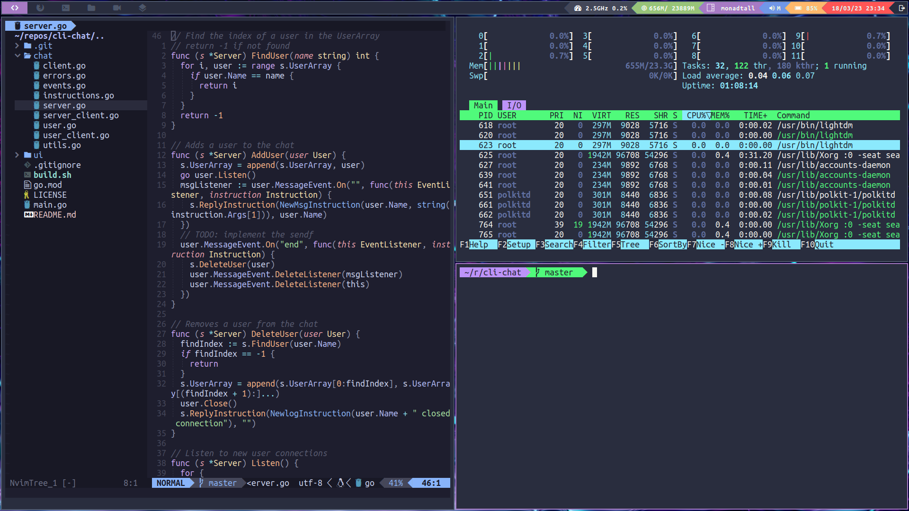

# My dotfiles

This is a repo with my configurations of my work enviroment.
I use [Arch linux](https://archlinux.org/), [neovim](https://neovim.io/), and [Qtile](http://www.qtile.org/) window manager.

**NOTE: this repo is constantly changing with new features and tools.**

## Installation

See the [guide](./INSTALL.md) for install and get my configurations of the tools I use.

**NOTE: this is not a Arch linux installation guide, is only a guide for setup the bootloader
window manager, ... For install Arch check the official guide in the arch wiki.**

## Special tools

In my case I use a Asus ROG gaming laptop, and
I recomend [this guide](https://asus-linux.org/wiki/arch-guide) for set-up some tools.

And for the nvidia drivers, I recomend the Nvidia page of [ArchWiki](https://wiki.archlinux.org).

## License

dotfiles Copyright (c) 2023 Guillex387. All rights reserved.

Licensed under the [MIT](./LICENSE) license.
